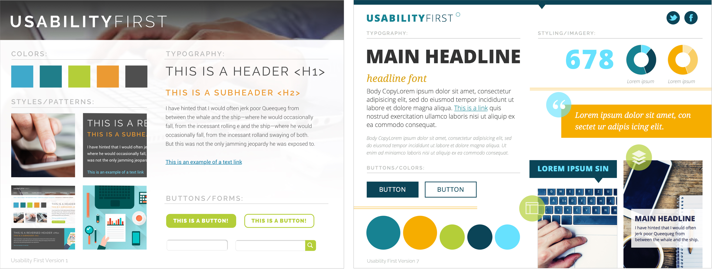

#Creating Style Tiles
###What are style tiles and why are they valuable?
Style tiles are design deliverables for an application or website that consist of colors, typography, and other relevant user interface components. As opposed to full-fledged mockups, they don’t focus on specific devices or layout. They’re a quick and easy way to determine a design direction early on in a project.

Style tiles save time and budget by clarifying a design direction before spending unnecessary time and energy creating a variety of hi-fidelity mockups that won’t all be utilized. The style focus created by tiles allows more time to be spent on the details of components. When starting with full-fledged mockups, it’s overwhelming for both designer and client. It’s unclear what to focus on, whether it be layout, colors, components, content, etc, and this complicates communication. Client feedback is easier to integrate and iterate upon with style tiles due to the focus on individual components and the overall look and feel.

###How to begin?
Before creating style tiles it is beneficial to have a definition of success, top user goals, top business goals, and maybe a few adjectives to describe what is desired of the outcome. These adjectives can later be incorporated into the style tiles. Sometimes this will require asking the client further questions about their preferences and goals if they are not already known. In cases that a client already has a brand defined, the style tiles and components within them will be a refresh of that brand.

*Style tiles for possible design directions for Usability First*

Some possible components of a style tile are:
* Logo
* Colors
* Typography
* Styles/Patterns
* Adjectives
* Project name
* Version number

Every style tile should have the project name and style tile version labeled to easily distinguish them from one another when communicating with others. The logo, colors and typography are essential parts for defining the look and feel. The styles/patterns can be blocks of just about anything that contributes to the overall look of the style tile (i.e. image treatments, icon styles, navigation elements, etc.). It can also be helpful to label components’ attributes where it seems necessary (i.e. hex values, fonts, font sizes, font weights, line heights, etc.). Using a template as a starting point is helpful as a starting point and from there the tile can evolve as you see fit. 

Other user interface components that are specifically relevant to the project at hand should be added. Use your best judgement to not go too overboard on the amount of components in a style tile, as the goal is simply to define a general design direction.

###Practices that I’ve found helpful
Everyone works differently, but when creating style tiles I’ve found that it is helpful to have a sort of “exploration” artboard (or page or file depending on what program you’re using). When I’m constrained to the style tile template right off the bat I tend to end up feeling stagnated and ideas just don’t flow as well. By having an exploration artboard I can try out a lot of different things before committing them to a style tile. The additional resources below contain a Sketch 3 format style tile template, as well as two sources that give an overview of traditional and less traditional style tiles.

###Additional Resources:
[Style Tile Template for Sketch 3](https://github.com/armichko/Sketch3-StyleTile-Template)

[http://styletil.es/](http://styletil.es/) 

[https://echo.co/blog/style-tiles-no-its-not-home-page](https://echo.co/blog/style-tiles-no-its-not-home-page)
